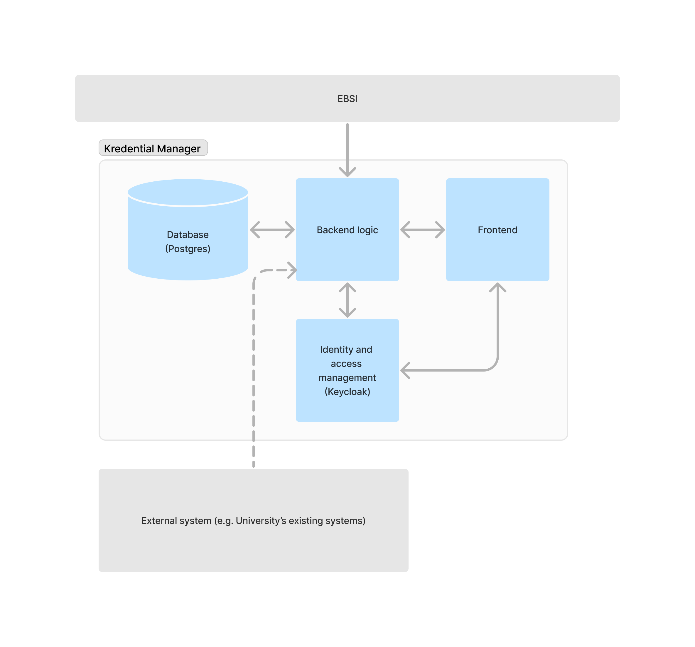

# Kredential Manager (EBSI Enterprise Wallet)

Kredential Manager is a reference implementation of the EBSI Enterprise Wallet as part of the EBSI Vector project developed and maintained by Protokol B.V.

It is primarily intended to be used by organizations wanting to issue verifiable credentials in accordance with EBSI guidelines. The frontend of this implementation is flavoured towards the so-called "diploma use case" (student/university relationship) as an example, but the underlying issuance mechanisms are universal and could easily be adapted for other use cases as well.

## User flow - issuance of a verifiable credential (diploma use case)
- Using a holder wallet (like Kredential wallet by Protokol B.V.) a student can request a verifiable credential from the university they attend
- Using the Kredential Manager an administrator at the university sees a request for a verifiable credential has been submitted. They have an option to approve or deny the request.
- After that the holder wallet user will be able to either receive the verifiable credential or is notified the request has been denied

## Architectural overview & design
The image below shows a high level view of the major parts of the Kredential Manager basic parts. Most (Backend, Identity and access management, Database) are separate Docker images. It also connects to a couple od "outside" services:
- EBSI layer mainly used for the verification of publicly available DID documents.
- An external system providing data needed to populate requested verifiable credential schemas. 
 
In the reference implementation this data has to be entered manually through a form. In the pilot implementation phase data would ideally come from an external system and there would be no need for manual data input. 
Current implementation is running on AWS infrastructure. CDK scripts to simplify deployment to AWS are also included as part of this implementation.



### Project Structure

```text
.
├── apps
│   ├── backend
│   ├── cdk
│   ├── kredential-base
│   ├── kredential-rpc
│   ├── kredential-sdk
│   └── frontend
└── docs
```

### Apps Folder
Currently, contains working directories for:
- `cdk` - AWS CDK for deploying infrastructure (if needed). AWS CDK is IaC (Infrastructure as Code) framework for AWS making it easy to deploy same infrastructure to various environments.
- `backend` - Backend application. Currently using [Nest.js](https://nestjs.com/).
- `frontend` - Frontend application. Currently using [Next.js](https://nextjs.org/) and [tailwindcss](https://tailwindcss.com/).

### CI/CD

For CI/CD we are currently using GitHub Actions.

### Prerequisites
The organisation running this system needs to be onboarded to EBSI first. That means it needs to have a DID created and the DID document needs to be registered to EBSI. Details on this can be found here:
[EBSI-Hub Onboard](https://hub.ebsi.eu/tools/cli/onboard)

## Quick Start Guide

This guide will help you quickly set up and run the Kredential Manager project, which includes a backend service using NestJS, a PostgreSQL database, and Keycloak for identity and access management.

### Prerequisites

Ensure you have the following installed on your machine:

- **Node.js** and **pnpm**: For running the backend and frontend applications.
- **Docker** and **Docker Compose**: For running PostgreSQL and Keycloak services.
- **Git**: For cloning the repository.

### Steps

1. **Clone the Repository**

   ```bash
   git clone https://github.com/protokol/kredential-manager.git
   cd kredential-manager
   ```

2. **Set Up Environment Variables**

   Create a `.env` file in the root directory and populate it with the necessary environment variables. You can use the `.env.example` file as a template.

   ```bash
   cp .env.example .env
   ```

3. **Start Docker Services**

   ```bash
   pnpm docker:up
   ```

4. **Install Dependencies**

   Navigate to the backend directory and install the necessary dependencies using `pnpm`:

   ```bash
   cd apps/backend
   pnpm install
   ```

5. **Run the Backend Application**

   ```bash
   pnpm run start:dev
   ```

6. **Access Keycloak**

   Access the Keycloak Admin Console at `http://localhost:8080/auth/admin/` and log in using the admin credentials specified in your `.env` file.

7. **Verify the Setup**

   - **Backend**: Access the API documentation at `http://localhost:3000/api`.
   - **Keycloak**: Ensure you can log in to the Keycloak Admin Console.

8. **Additional Configuration**

   - **Database Migrations**: Run any necessary database migrations using the provided scripts in the backend package.json.
   - **Frontend**: If applicable, set up and run the frontend application following similar steps.


## Documentation
- [Keycloak Setup Guide](./docs/keycloak-setup.md)

## License
This project is licensed under a dual license model. For use with the EBSI Vector Pilot project, it is available under the GNU Affero General Public License v3.0 (AGPL-3.0). For all other uses, a commercial license is required. Please refer to the [AGPL-3.0 license text](https://www.gnu.org/licenses/agpl-3.0.en.html#license-text) for more details on the terms and conditions. For commercial licensing inquiries, please contact us at info@protokol.com.

# Contact Us For Support And Custom Development

info@protokol.com


---


