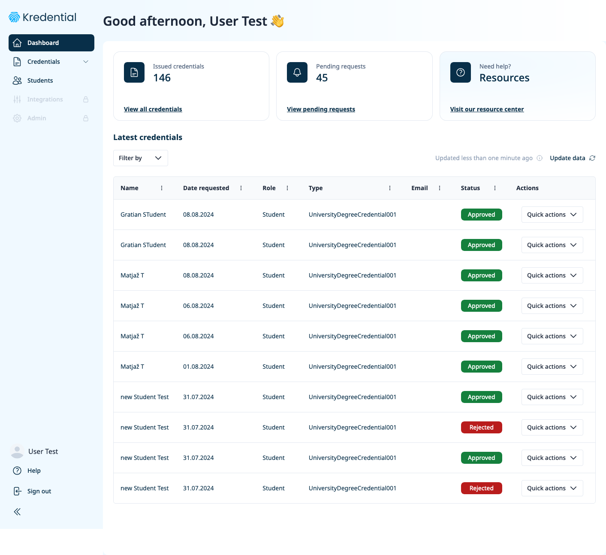
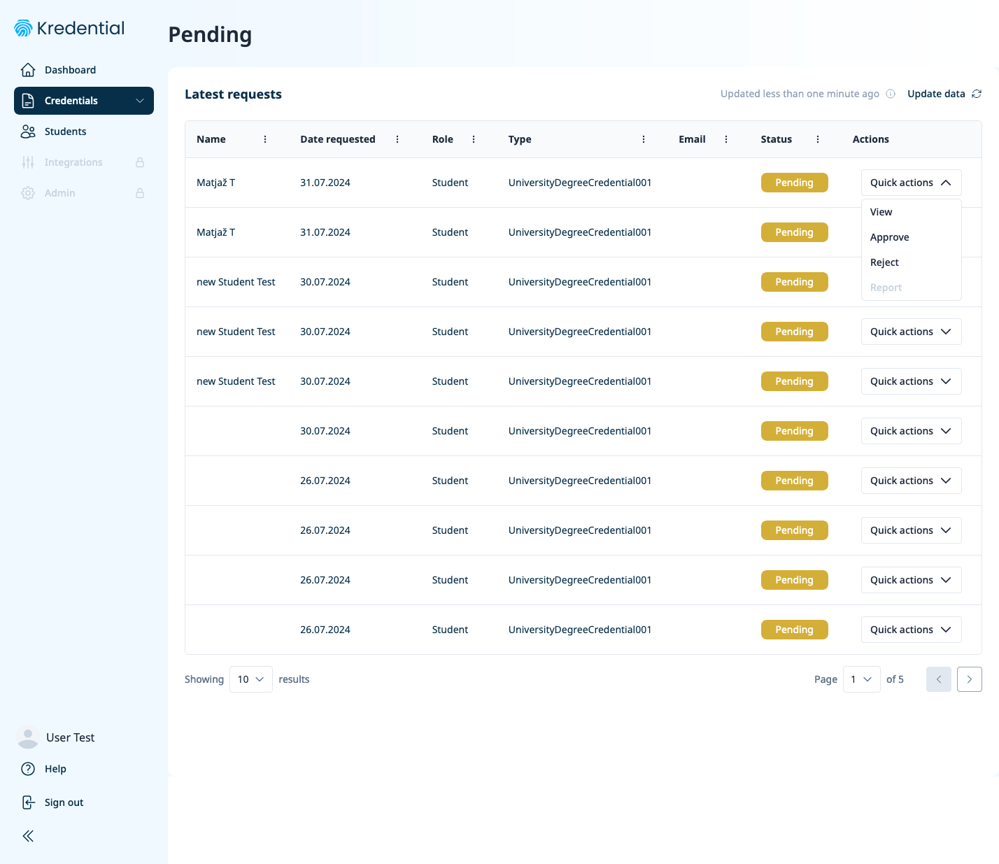
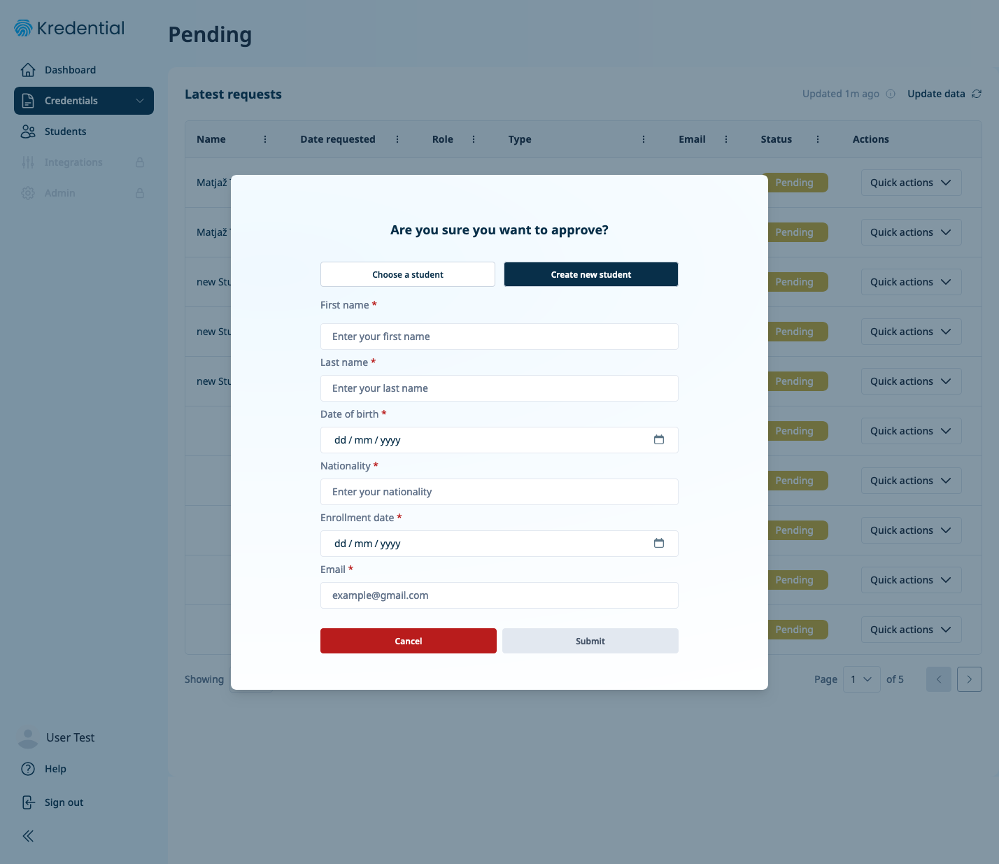
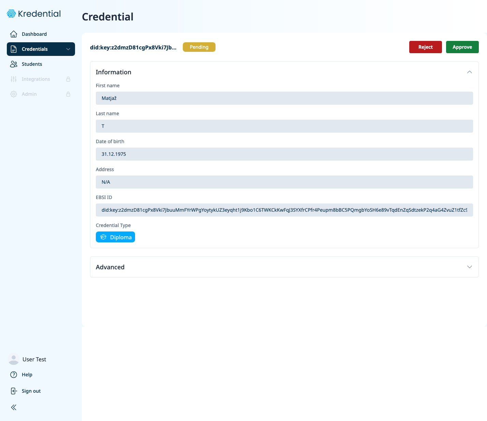
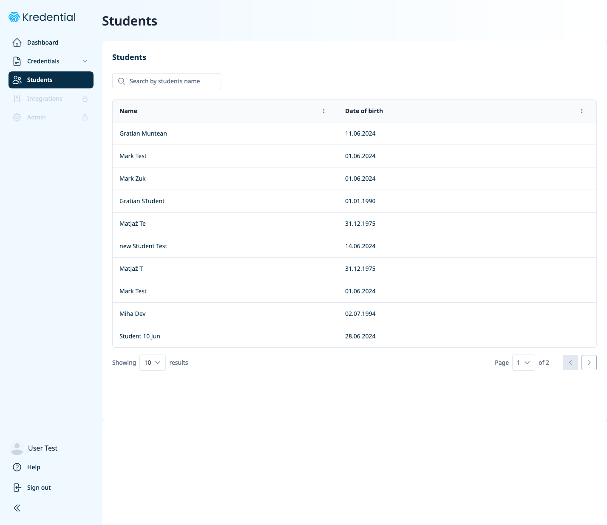

# Kredential Enterprise Wallet - user manual

## Introduction to Verifiable Credentials

Verifiable Credentials (VCs) are digital attestations issued by a trusted authority, which can be verified cryptographically. They are used to prove claims about a subject (e.g., a person or an organization) and are part of the European Blockchain Services Infrastructure (EBSI). In order to be able to issue VCs the issuer needs access to an Enterprise Wallet.

For a more detailed explanation on verifiable credential issuance please refer to EBSI [documentation](https://hub.ebsi.eu/conformance/learn/verifiable-credential-issuance#user-authentication)

### Credential Issuance Process

 - Credential Request: The process begins when a subject requests a credential from an issuer. Usually this is done with the help of the so-called Holder Wallet such as the [Kredential holder wallet](user-manual-hw.md) developed by Protokol B.V.

 - User Authentication: To ensure the security and legitimacy of the request, the subject must authenticate themselves. This can involve various methods, including digital identities, cryptographic keys, or other authentication mechanisms.

 - Credential Creation: Upon successful authentication, the issuer creates the verifiable credential. This credential contains the claims about the subject and is signed using the issuer's private key to ensure its integrity and authenticity.

 - Credential Storage: Once issued, the credential can be stored in a digital wallet controlled by the subject (holder wallet). This wallet enables the subject to manage and present their credentials as needed. 

### Key Actors in the VC Ecosystem

- Issuer: The entity that creates and issues the verifiable credential.
- Holder: The individual or organization that receives and holds the verifiable credential.
- Verifier: The entity that checks the validity and authenticity of the credential.

## Dashboard
Dashboard is the first screen presented after the successful login and serves as a quick overview of current situation.

## Credentials
There are 3 different statuses a credential can have:
- Pending - user has requested a credential but the request has not been processed yet by the issuer.
- Issued - after the VC has been approved it moves to the status Issued and is now ready to be downloaded to the holder wallet. Please not that this action has to be through the holder wallet by the user that requested the VC.
- Rejected - if for some reason the issuer thinks the user is not entitled to the certificate they can reject it.

## Issuing a credential
From the list of all requests with the status of "pending" select the one you wish to view, approve or reject. The "Quick actions" menu on the right has options for all available actions.

Before approving a request student info needs to be entered. 
> [!IMPORTANT]  
> Please note this form is only available in this reference implementation on order to be able to test the functionality. In the "real world" implementations this data needs to come from an external system and there would be no need for manual data input. 

Once all the data is entered and verified the VC can be approved (or rejected). Once this is done its status will change to "Approved" or "Rejected" depending on the action that took place. 

## Students
This section is only available in the reference implementation for testing purposes. There should be no need for this in "real world" implementations as this data should come from external system(s).

