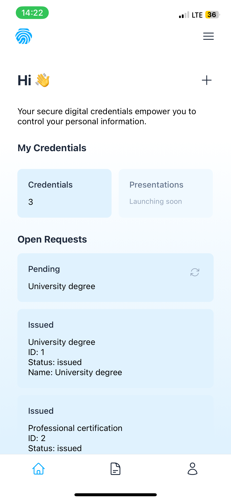
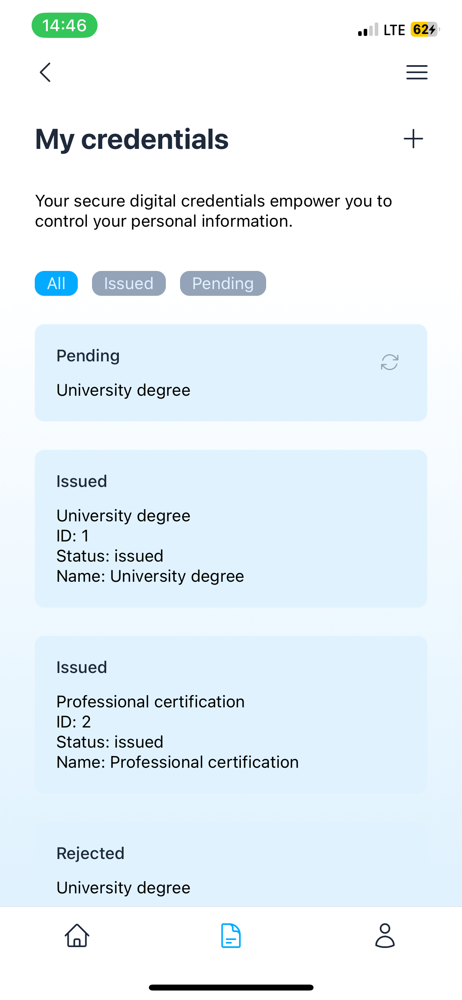
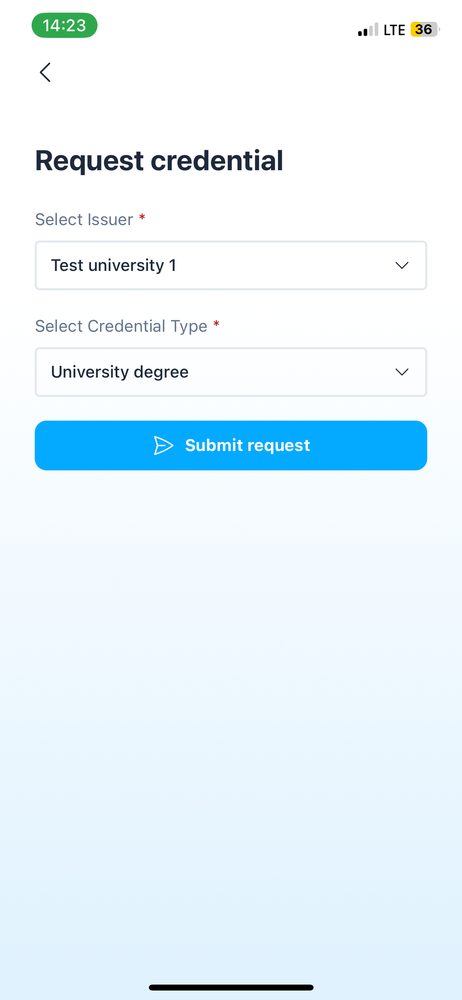
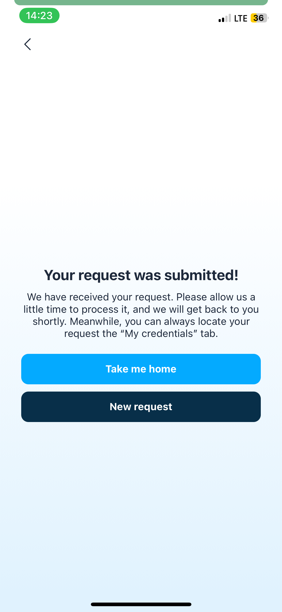
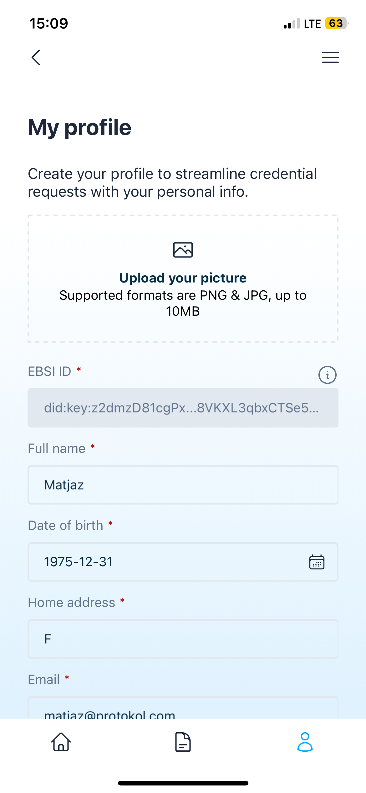

# Kredential Holder Wallet - user manual

If you are interested in the issuance of verifiable credentials please take a look at the [Kredential Enterpride Wallet](user-manual-ew.md)

## Dashboard
Dashboard is the first screen presented after the successful login and serves as a quick overview of all credentials

## Credentials
Here a user can see all their credentials. There are 2 different statuses a credential can have:
- Pending - user has requested a credential but the request has not been processed yet by the issuer.
- Issued
- Rejected
- 

## Requesting a new credential
User can request a new credential by clicking the + icon on the Credentials page. For test purposes we have entered 2 Test universities and 2 credential types. After clicking the "Submit request" button the request gets submitted to the issuers enterprise wallet.

## My Profile
In this section a user can see their DID (EBSI ID) and other personal info

